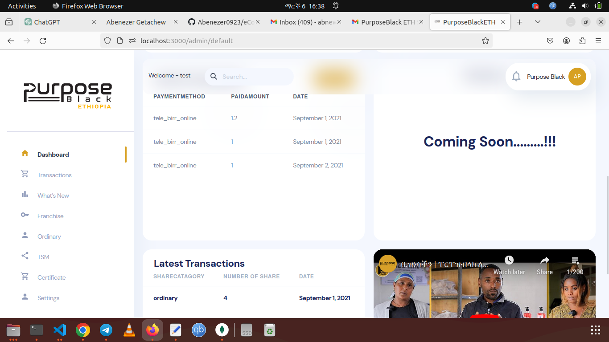
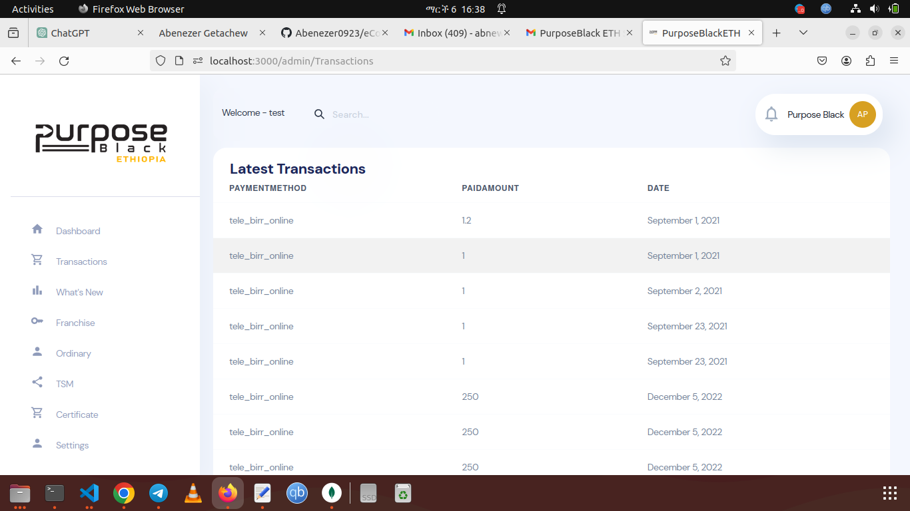
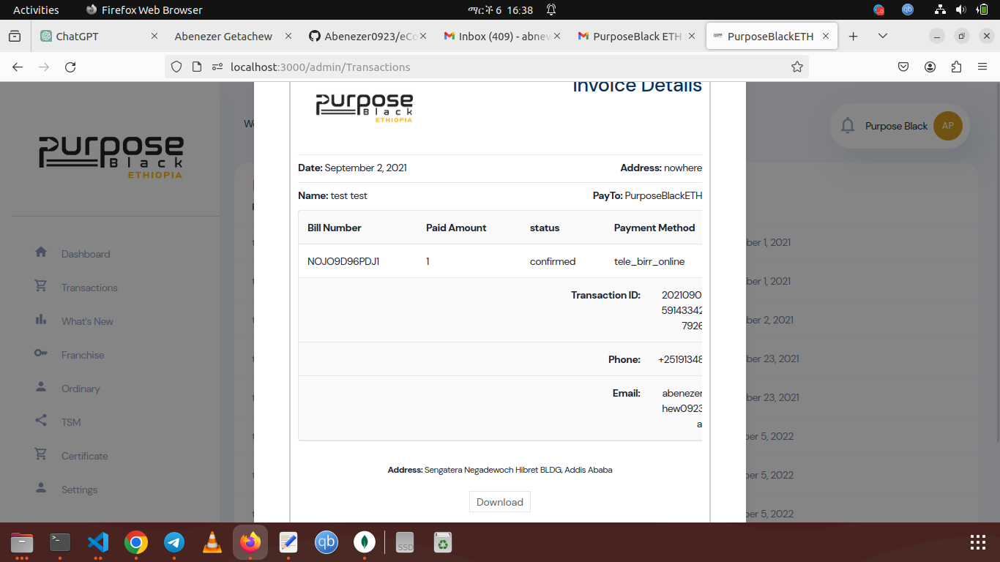

# Shareholders Management System

The Shareholders Management System is a comprehensive solution designed to streamline and organize the management of company shareholders. This system offers an intuitive and efficient platform to track, monitor, and interact with shareholders seamlessly.

## Features

- **User-Friendly Interface:** The system provides a user-friendly interface, ensuring ease of use for both administrators and shareholders.

- **Shareholder Profiles:** Each shareholder has a dedicated profile where relevant information, such as contact details, shareholding history, and communication preferences, is stored.

- **Share Transaction History:** The system records and displays a detailed history of share transactions, making it easy to track changes and updates.

- **Communication Center:** Facilitate effective communication with shareholders through an integrated messaging system. Keep them informed about company updates, meetings, and other relevant information.

- **Document Repository:** A centralized repository for important documents, such as shareholder agreements, financial reports, and meeting minutes. Shareholders can access and download documents as needed.

- **Customizable Reports:** Generate customizable reports to analyze shareholder data, shareholding patterns, and other key metrics, aiding in strategic decision-making.

## Screenshots

![Shareholder Dashboard]

*Caption: Shareholder Dashboard providing an overview of key information.*

*Caption: Share Transaction History for detailed tracking of share changes.*

![Communication Center]
*Caption: Communication Center for seamless interaction between administrators and shareholders.*

